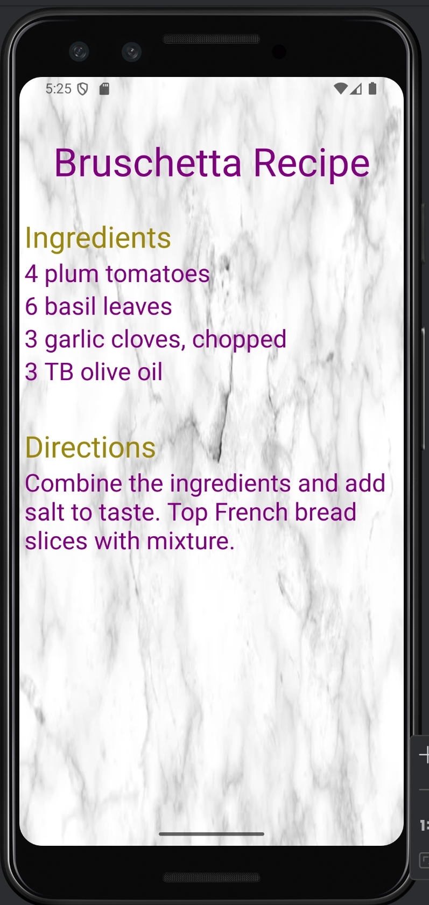
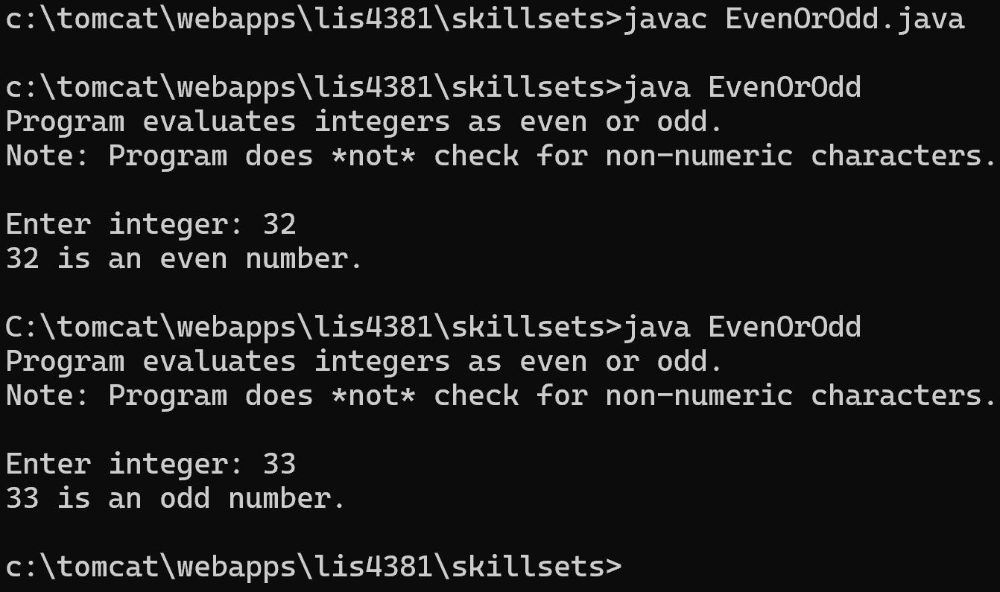
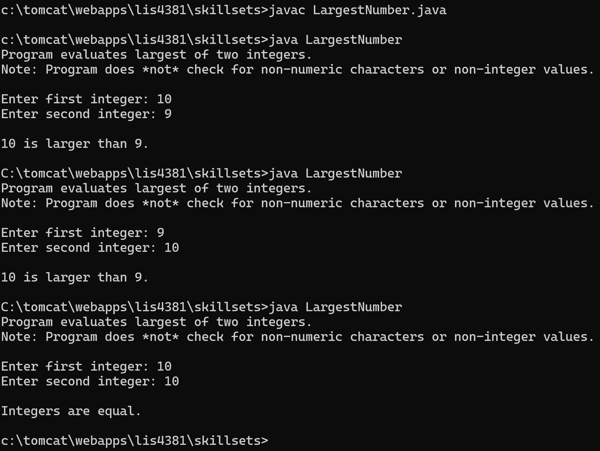
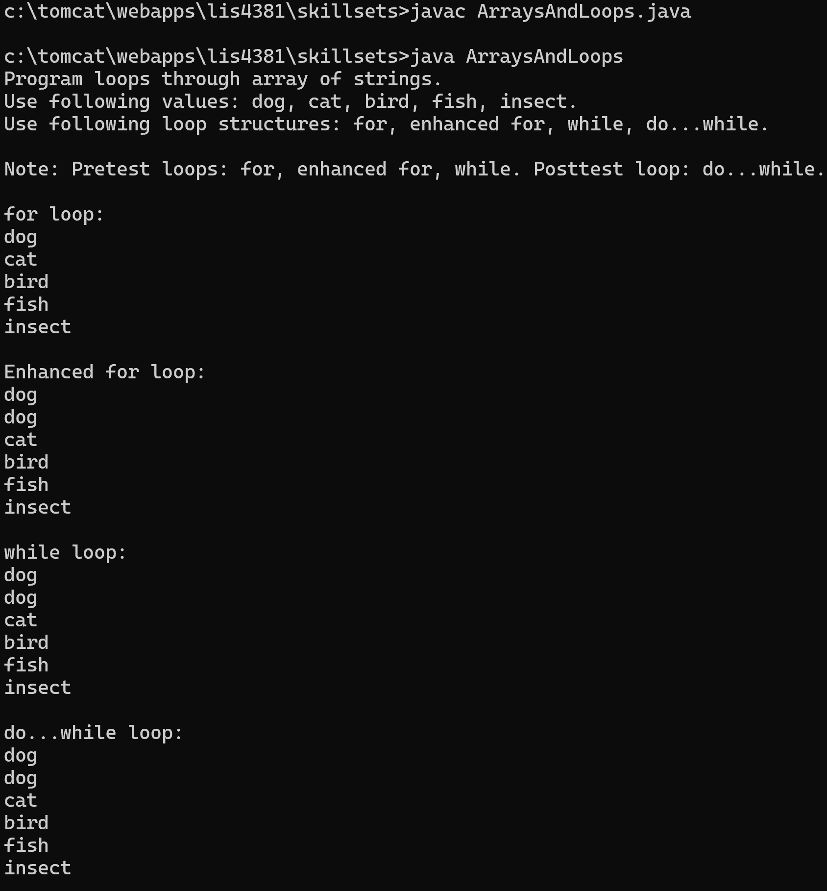

> **NOTE:** This README.md file should be placed at the **root of each of your repos directories.**
>
>Also, this file **must** use Markdown syntax, and provide project documentation as per below--otherwise, points **will** be deducted.
>

# LIS4381 - Mobile Web Application Development

## Ryan Parks

### Assignment #2 Requirements:

*Four Parts:*

1. Bruschetta Recipe application
2. Provide screenshot of first activity running
3. Provide screenshot of second activity running
4. Provide screenshots of skillsets 1-3

#### README.md file should include the following items:

* Screenshots of recipe activities running in android studio
* Screenshots of skillsets 1-3 running

> This is a blockquote.
> 
> This is the second paragraph in the blockquote.
>

#### Assignment Screenshots:

*Screenshots of A2 running in android studio:*

|  |  |
|:-----------------------------------------:|:-----------------------------------------:|
*Screenshots of SkillSets:*
|  |  |
|  |