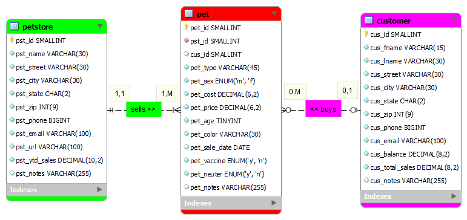
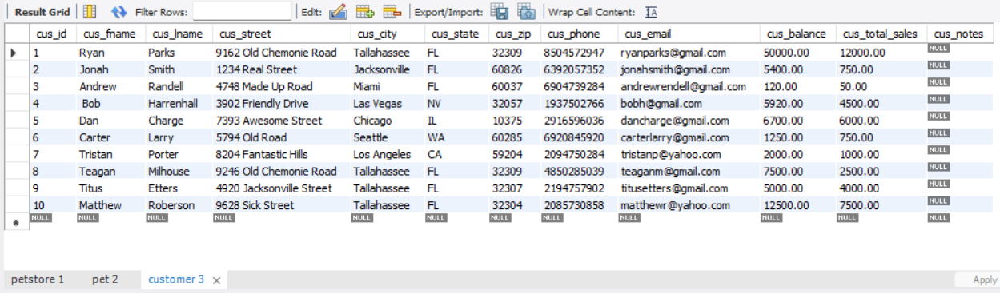
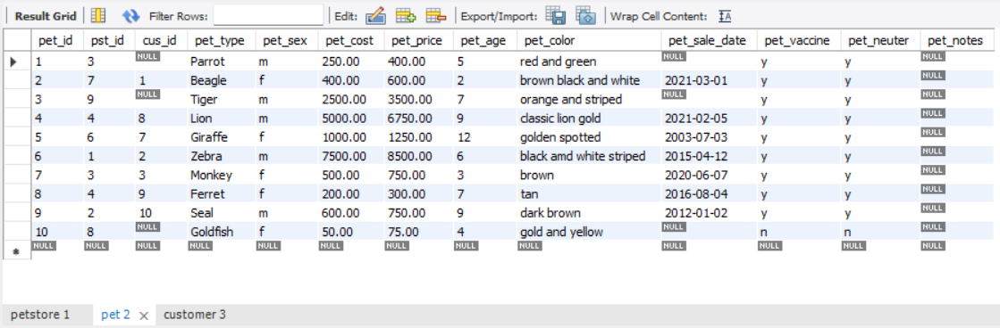
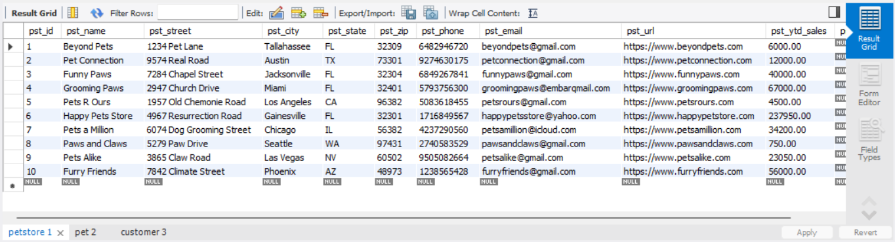
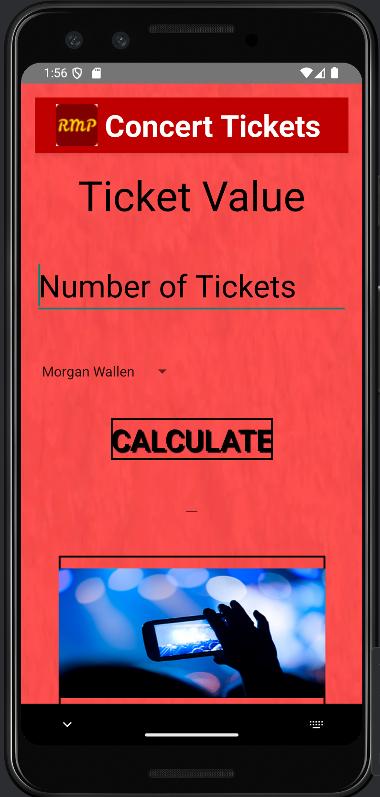
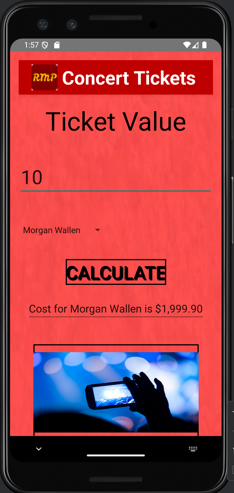
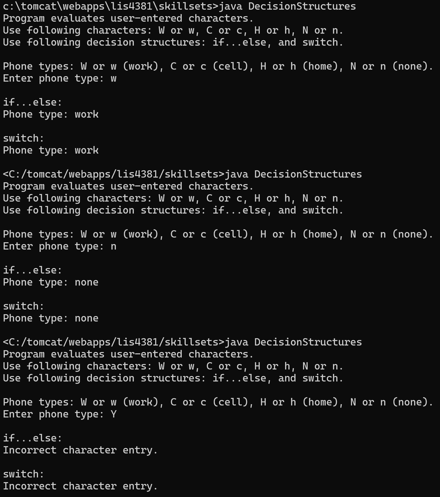
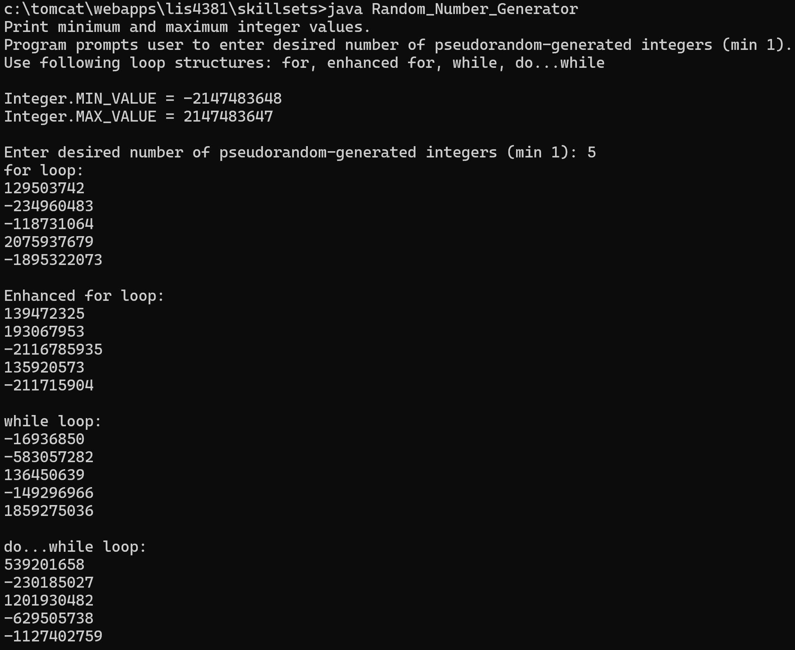
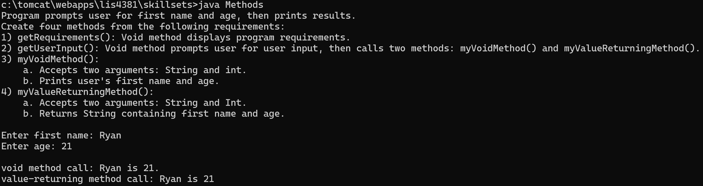

> **NOTE:** This README.md file should be placed at the **root of each of your repos directories.**
>
>Also, this file **must** use Markdown syntax, and provide project documentation as per below--otherwise, points **will** be deducted.
>

# LIS4381 - Mobile Web Application Development

## Ryan Parks

### Assignment #3 Requirements:

*Three Parts:*

1. Creating ERD
2. Creating ticket value application
3. Completing skillsets

#### README.md file should include the following items:

* Screenshots of ERD and 10 records in each table
* Screenshots of ticket value application opening and running pages
* Upload and link to A3 .mwb and .sql files: [a3.mwb](docs/a3.mwb "A3 MWB") [a3.sql](docs/a3.sql "A3 SQL")

> This is a blockquote.
> 
> This is the second paragraph in the blockquote.
>

#### Assignment Screenshots:

*Screenshots of A3 ERD, ticket value application opening and running pages, and skillsets 4-6*

|  |  |
|:-----------------------------------------:|:-----------------------------------------:|
|  |  |
|  |  |
*Screenshots of skillsets 4-6*
|  |  |
|  |