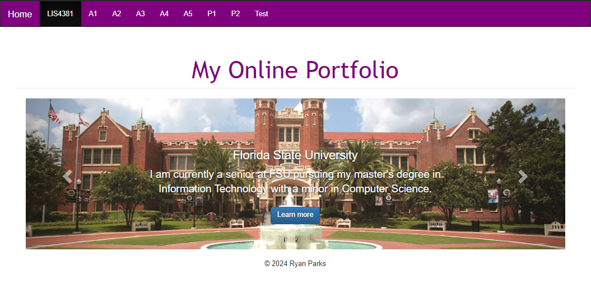
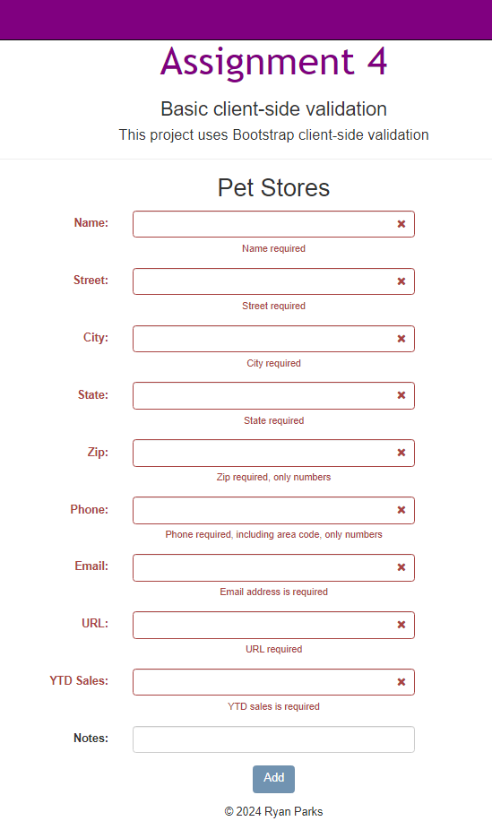
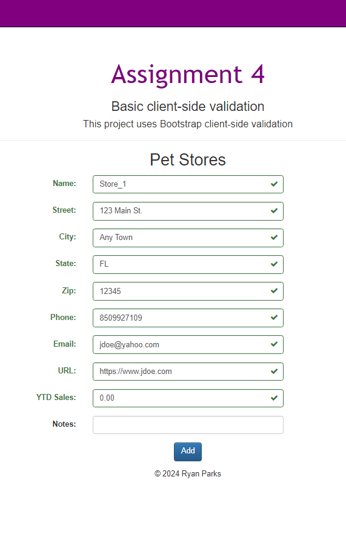
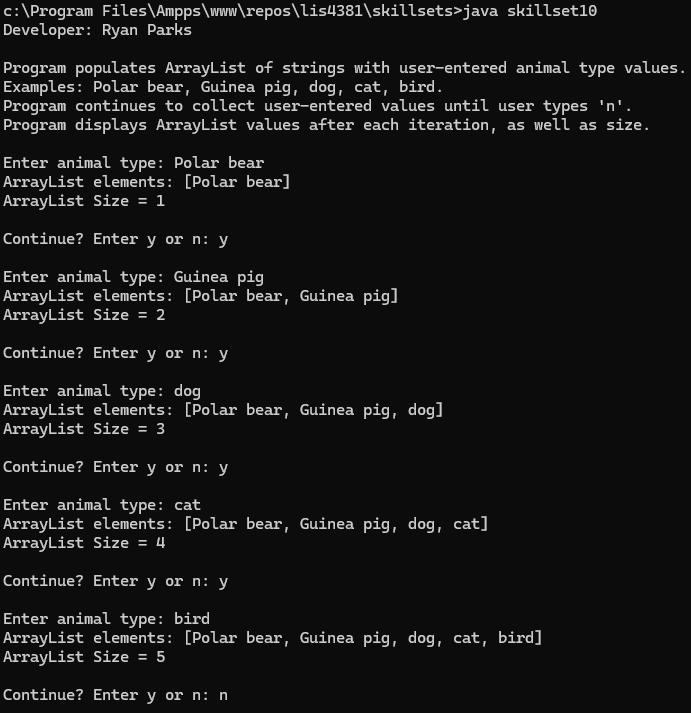
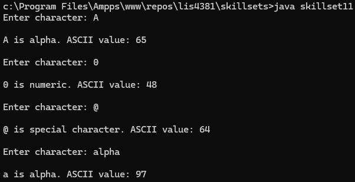
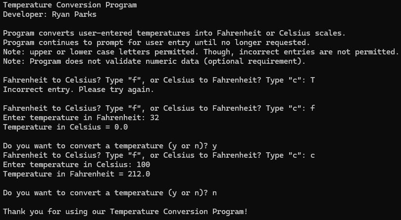

> **NOTE:** This README.md file should be placed at the **root of each of your repos directories.**
>
>Also, this file **must** use Markdown syntax, and provide project documentation as per below--otherwise, points **will** be deducted.
>

# LIS4381 - Mobile Web Application Development

## Ryan Parks

### Assignment #4 Requirements:

*Three Parts:*

1. Transfer repository to online portfolio
2. Implement bootstrap client-side validation
3. Complete skillsets 10-12

#### README.md file should include the following items:

* Screenshots of portal home page
* Screenshots of failed validation and passed validation
* Screenshots of completed skillsets 10-12

> This is a blockquote.
> 
> This is the second paragraph in the blockquote.
>

#### Assignment Screenshots:

*Screenshots of A3 ERD, ticket value application opening and running pages, and skillsets 4-6*

|              |         |         |
|:----------------------------------------:|:-----------------------------------------------------:|:-----------------------------------------------------:|
|        |                     |                     |

